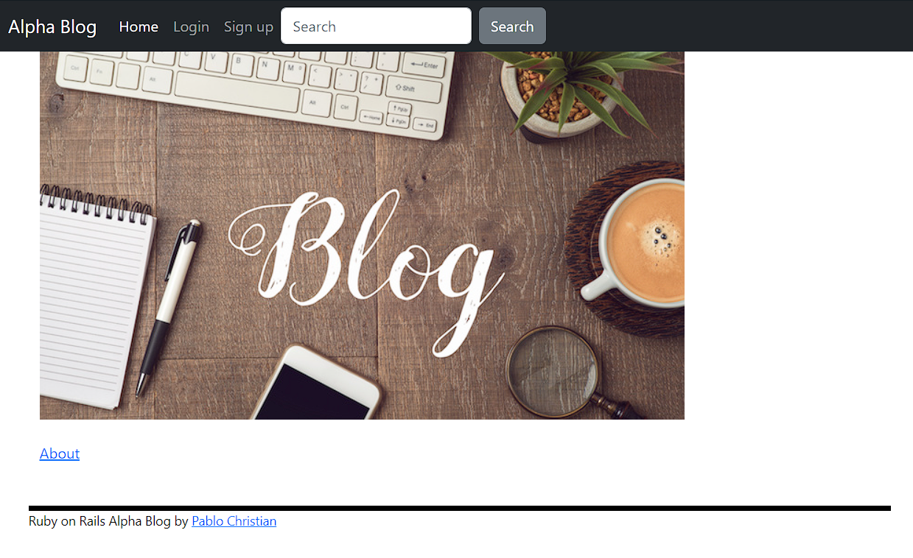

<h1>
  Alpha blog
</h1>

## 📌 Overview
A blog application using Ruby on Rails

## 📑 Demonstrations

## 🧾 Features
<ul>
	<li>✔ Login</li>
	<li>✔ Logout</li>
  <li>✔ CRUD Articles</li>
</ul>

## 💻 Technologies
These are the technologies and patterns used to develop this application
- [Ruby](https://www.ruby-lang.org/)
- [Rails](https://rubyonrails.org/)

## ⚙️ Executing the Project
To execute the project, follow the steps below:
1. To start the application local, type "rails server".
2. open browser and access the URL "http://127.0.0.1:3000".
